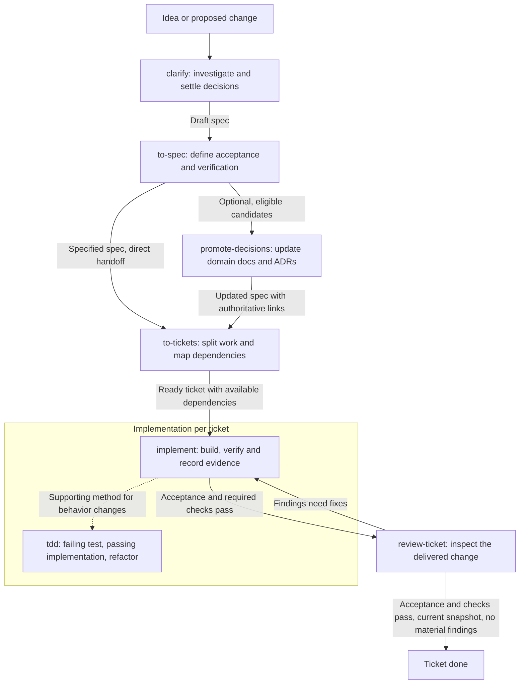

# Engineering workflow skills

This repository versions the skills and support documents for my engineering workflow.

Each phase saves its output so work can continue in a later session. Invoke phases explicitly. Each phase identifies the next input without starting the next phase automatically.

## Workflow



The arrows show handoffs that the user invokes. Promote decisions before ticketing when tickets depend on authoritative vocabulary, ownership boundaries or constraints. Otherwise, promotion is optional. TDD supports implementation and can also be invoked on its own; it is not a mandatory separate phase.

## Steps

1. [`clarify`](workflow/clarify/SKILL.md) investigates code and tests, resolves material questions with the user, and records decisions, scope and documentation candidates in a draft spec. Completed clarification leaves the spec in `draft` status.
2. [`to-spec`](workflow/to-spec/SKILL.md) refines the draft or settled requirements into observable acceptance criteria and a verification approach. It evaluates documentation candidates and marks the spec `specified` when material questions are resolved.
3. [`promote-decisions`](workflow/promote-decisions/SKILL.md) optionally moves eligible candidates from an explicitly supplied, specified spec into authoritative domain documentation or architectural decision records, ADRs. It preserves the candidate history and links the authoritative documents back to the spec.
4. [`to-tickets`](workflow/to-tickets/SKILL.md) splits the spec or settled requirements into work items sized for separate implementation sessions. Each ticket includes acceptance coverage, dependencies, required reading and verification. A ticket is `ready` only when requirements are settled and dependency outputs are available.
5. [`implement`](workflow/implement/SKILL.md) completes one ticket or bounded change, runs the required checks, and saves progress and verification evidence in the ticket. Passing work moves to `review`; an unavailable prerequisite or required check leaves it `blocked` with a resume condition.
6. [`tdd`](workflow/tdd/SKILL.md) supports new behavior and reproducible bug fixes through a failing test, the smallest coherent implementation, and refactoring while tests pass. Ticket-based work records evidence in the ticket; standalone work uses a TDD record. Documentation and mechanical refactors use checks appropriate to the change.
7. [`review-ticket`](workflow/review-ticket/SKILL.md) checks the exact delivered change against requirements and repository invariants, then saves findings and acceptance evidence in a review report. Fixes return through implementation and another review. A ticket becomes `done` only when the reviewed snapshot is current, acceptance and required checks pass, and no material finding remains.

The skills can also accept direct inputs where their instructions allow it, such as settled requirements for specification or a bounded change for implementation. Use a fresh session for each implementation ticket and preferably for review.

## Support documents

- [Workflow conventions](docs/agents/workflow.md) define artifact locations, status transitions and verification requirements for the local pilot.
- [Issue tracker configuration](docs/agents/issue-tracker.md) defines local Markdown files as the tracker. No external tracker is configured.

The pilot keeps each feature's draft and specified spec at `docs/work/<feature>/spec.md`, tickets at `docs/work/<feature>/tickets/<NN>-<name>.md`, and reviews at `docs/work/<feature>/reviews/<ticket-stem>.md`. Implementation and ticket-based TDD share the ticket's execution record. Standalone TDD uses `docs/work/<change>/tdd.md`. Target projects can configure their own locations.

## Use

Copy the relevant directories from `workflow/` under the target project's `.agents/skills/`. Include `tdd` when using it as implementation guidance. Copy and adapt the support documents to the project's locations, tracker and required checks, and link them from its `AGENTS.md`.

For Claude Code, copy the skill directories under `.claude/skills/` and link the support documents from `CLAUDE.md`. Use `/skill-name` in place of the Codex `$skill-name` syntax below. Workflow phases require explicit invocation in both clients.

For the local pilot, invoke the skills with full artifact paths:

```text
$clarify <idea>
$to-spec docs/work/<feature>/spec.md
$promote-decisions docs/work/<feature>/spec.md
$to-tickets docs/work/<feature>/spec.md
$implement docs/work/<feature>/tickets/01-<name>.md
$review-ticket docs/work/<feature>/tickets/01-<name>.md
```

Skip `promote-decisions` when no eligible promotion is needed. To resume clarification, pass the draft spec path to `clarify`. For review fixes, invoke `implement` with the ticket and review reference, then invoke `review-ticket` again. Invoke standalone TDD with `$tdd <bounded behavior or ticket path>`.
